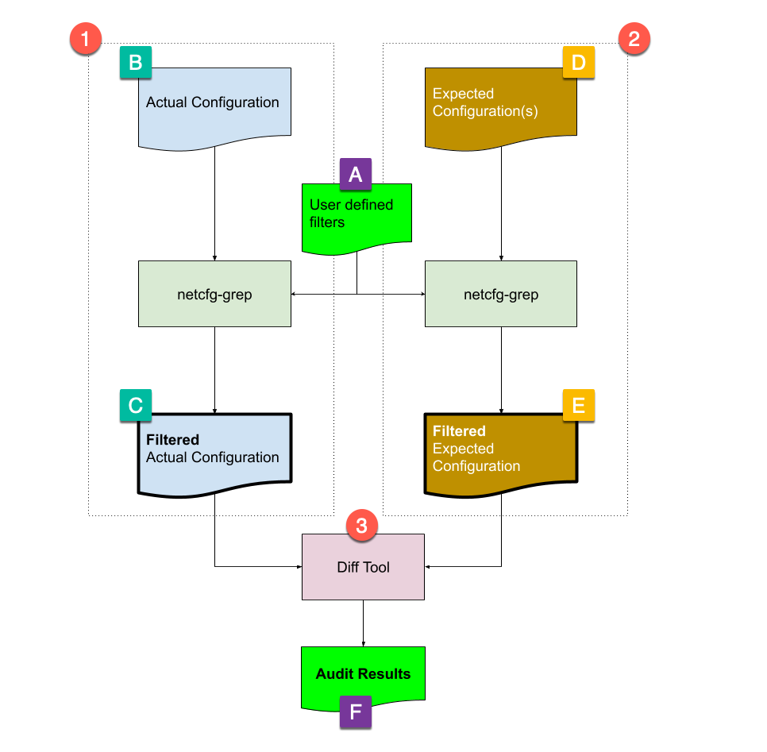

# Network Device Config Grep Tool

This package contains a tool called `netcfg-grep` that allows a User to extract (grep)
specific sections of a network configuration file.

**The motivating Use-Case**

As a member of the network team I need to perform configuration audits.  I need
a tool that will allow me to selectively extract sections of the config that I need
to examine as I might not want to compare the entire configuration file.  For example,
I might want to only check the "IP access Lists" or the "VLAN interfaces" for audit
compliance.

As such, I would use the `netcfg-grep` tool to extract only those sections I
want to examine from the actual configuration file.  I will also have
**expected** configuration file(s).  I would use the same netcfg-grep control
file to extract the same sections from the expected configuration file so
that I could diff the results of the acutal config against the results of
the expected config.

I want to be able to obtain the actual network configuration file independently
of the `netcfg-grep` tool.  I may have another system that keeps these files,
or I may want to retrieve them on demand.

I want to be able to perform the diff of the actual configuration and the
expected configuration independently of the `netcfg-grep` tool. I could use
icdiff on my laptop, or I might want to use Github compare feature.

# Overview

The following diagram illustrates the general process to use the `netcfg-grep` tool
for audit purposes.



Create a `netcfg-grep` filter control file (A) that defines your specific
sections you want to extract from the device configuration files.  This is a YAML file, and the
structure of this file is described [here](docs/config.md).

Next, process (1), is to execute the `netcfg-grep` tool using the actual
configuration file (B). The output output file (C) will contains only the
sections defined in the control file (A).

Next, process (2) is to do the same with expected configuration (D) using the same
grep control file (A).  The output file (E) will contain only the sections defined
int he control file (A).

At this point the output files (C) and (E) contents can be diff'd using any text-diff tool, or
system that supports diff'ing such as github.  The text difference, output (F), represents
whether the audit is a "pass" or "fail."

# Installation

This package is not yet available in PyPi.  To install in your local environment:

```shell
pip install netcfg-grep@git+https://github.com/jeremyschulman/netcfg-grep.git
```

# Usage

You will need to create a YAML configuration file that defines the sections of
the configuraiton to filter.  Once created, you can then use `netcfg-grep` to
extract the results from the network configuration file:

```shell
netcfg-grep -g grep-config-file.yaml -d device-config-file.txt > filtered-output.txt
```


